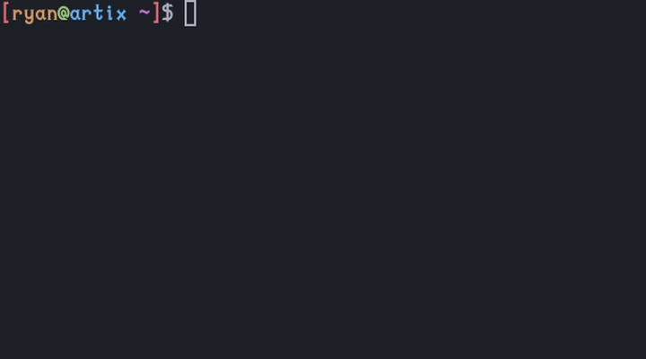

# README

This project aims to provide a simple to use TODO CLI app.

## Installation

	$ git clone --depth 1 https://github.com/grand-affirmation/rust-projects
	
	$ cd rust-projects/01\ -\ todo-manager/

	$ cargo install --path .

## USAGE 
	tm [OPTIONS] [args]

OPTIONS

	add     adds a new todo item
    	
	remove  removes a todo item
    	
	show    shows the list of todos

