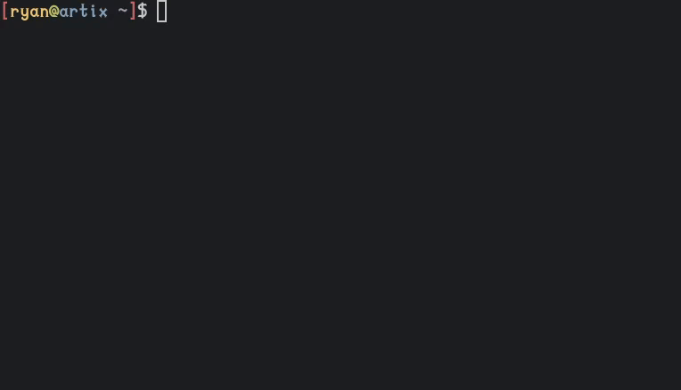

# README

A simple password generator.

## INSTALLATION

	$ git clone --depth 1 https://github.com/grand-affirmation/rust-projects
	
	$ cd rust-projects/02\ -\ password-generator/

	$ cargo install --path .

## USAGE
	`pg [OPTIONS] [LENGTH]`

## OPTIONS 
Prepend with '-'.
	u   use uppercase letters
        l   use lowercase letters
        n   use numbers
        s   use symbols

## EXAMPLE
        `pg -ulns 18`
        `pg -ln 20`

